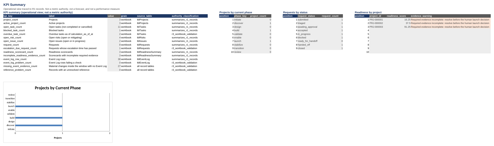
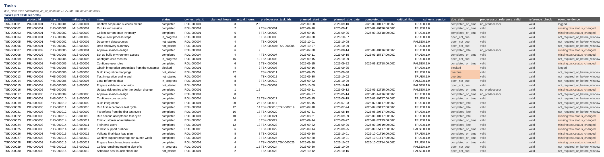

# implementation-tracker-workbook

A macro-free implementation tracker that applies the R1 operating model through deterministic spreadsheet formulas, synthetic data, and portable exports. One implementation professional can open one workbook and run implementation work with the R1 lifecycle, schemas, rules, and event contract.

> **Status: version 0.1.0, pre-release, not tagged.** This is a reference implementation of R1 ([`implementation-operating-system`](https://github.com/jmuldroweoi-sys/implementation-operating-system)), pinned in [`standard/standard-reference.yaml`](standard/standard-reference.yaml). It has not been historically deployed as this exact workbook. The bundled synthetic examples are not customer data, and nothing here reports a measured result.

R1 answers *what operating model implementation work should follow*. This workbook answers *how one implementation professional can run that model today*: open one file, update the rows that changed this week, and read what is late, blocked, risky, or not ready.



## Purpose

Prove that the R1 operating model is usable, not just documented. The workbook implements R1's records, statuses, rules, and calculations as spreadsheet tables and formulas, without reinterpreting any of them, so a person can run real projects in it and every number can be traced back to R1.

Designed and maintained by Jared Muldrow, an implementation and onboarding professional who runs delivery work hands-on and designs the systems, controls, and tooling around it. That experience informed the design as inspiration only: no employer document, data, or wording is used here.

## Who it is for

- **An implementation or onboarding professional working alone**, who needs one tracker for projects, tasks, risks, requests, gates, and readiness that takes well under an hour a week.
- **A small team** that wants shared tabs, drop-downs, and checks instead of a home-made sheet per person.
- **A growing organization** that needs tracker data it can export into capacity planning and reporting later without re-keying.

## What it demonstrates

- R1 can be run day to day in a spreadsheet with no macros, no add-ins, and no external links.
- Every status list, weight, band, scale, and timer comes from a pinned R1 version, not from the spreadsheet.
- Calculated R1 fields reproduce R1 exactly: exporting the bundled data gives files byte-identical to R1's own synthetic data.
- A spreadsheet can keep an honest event trail without pretending to auto-append events: it flags material changes that still need an Event Log row.
- Workload can be prepared for capacity planning without double counting and without doing capacity math.

## Relationship to R1

R1 owns the lifecycle, phase and gate vocabulary, project, task, request, handoff, risk, and issue statuses, request transitions, severities, the risk formula, readiness categories and weights, SLA and lead-time parameters, and the event catalog. This workbook (R3) owns only the workbook structure, the formulas that implement R1, check columns, imports and exports, workbook metadata, and the Capacity Inputs export format.

The pin is in [`standard/standard-reference.yaml`](standard/standard-reference.yaml): R1 commit `9acd25a4673facf2b3cca2467142987548949ce3` (repository version 0.1.0), shared standard 1.0.0. The R1 files the workbook needs are byte-identical copies under [`schemas/r1/`](schemas/r1/manifest.yaml) and [`data/synthetic/r1/`](data/synthetic/manifest.yaml), each with a SHA-256. [`tools/sync_r1_contracts.py`](tools/sync_r1_contracts.py) changes the pin only from an explicitly named R1 commit, never from "latest". If R1 changes, R3 is rebuilt and revalidated against the new pin. See [docs/architecture.md](docs/architecture.md).

## Workbook screenshot and visual description

The KPI Summary picture above and the Tasks picture below are rendered from the bundled synthetic workbook by [`tools/render_screenshots.py`](tools/render_screenshots.py) (LibreOffice prints a copy, so every value is a calculated formula result).



What opens:

- **README** shows a plain-language guide in column A and a settings table (`tblWorkbookSettings`) with the editable `calculation_as_of_at`, `event_reconciliation_from_at`, `selected_org_stage`, and `operating_mode` cells shaded yellow.
- **Record tabs** (Projects to Event Log) show Excel Tables starting at row 4, side by side on tabs with more than one table. Dark blue headers mark columns you edit, grey headers and grey cells mark formulas, and a light red or amber fill marks overdue tasks, due escalations, failed checks, and missing event evidence.
- **Lookups and Escalation Rules** show green-headed, read-only mirrors of R1 lists and rules, with the source file of every value.
- **Readiness Scorecard** states in red at the top: "Readiness score informs human review. It does not decide go or no-go."
- **KPI Summary** shows a compact KPI table, three small summary tables, and one bar chart, "Projects by Current Phase".

## Twelve tabs

| # | Tab | Tables | What you do there |
|---|---|---|---|
| 1 | README | `tblWorkbookSettings` | Read the guide; set the evaluation time, reconciliation window, stage, and mode |
| 2 | Lookups | `tblLookupEntries`, `tblReadinessWeights`, `tblRiskBands`, `tblRuleParameters` | Nothing: read-only R1 lists and parameters behind every drop-down and formula |
| 3 | Projects | `tblProjects` | Maintain project records |
| 4 | Phases and Gates | `tblPhases`, `tblMilestones`, `tblGateAssessments` | Record phase entry and exit, milestones, and each human gate outcome |
| 5 | Tasks | `tblTasks` | Maintain tasks, hours, dates, and dependencies |
| 6 | Requests and Handoffs | `tblRequests`, `tblHandoffs` | Move requests along legal R1 transitions; record handoff acceptance |
| 7 | Escalation Rules | `tblEscalationRules` | Nothing: read-only mirror of R1 SLA and lead-time rules ("Source of truth: R1 configuration.") |
| 8 | Risks and Issues | `tblRisks`, `tblIssues` | Log risks (the score is calculated) and issues |
| 9 | Readiness Scorecard | `tblReadiness`, `tblReadinessSummary` | Count criteria met per category before the launch review |
| 10 | Capacity Inputs | `tblCapacityInputs`, `tblCapacitySummary` | Classify workload rows for export to capacity planning |
| 11 | Event Log | `tblEventLog` | Append or import one row per material change |
| 12 | KPI Summary | `tblKpiSummary`, `tblPhaseSummary`, `tblRequestStatusSummary`, `tblReadinessByProject` | Read the weekly operational view |

There are exactly 12 visible sheets and no hidden sheets.

## Starter Mode

Set `operating_mode` to `starter`. Each week, update Projects, Tasks, Risks and Issues, and Requests and Handoffs; look at Readiness only as a launch approaches; add Event Log rows only for material changes; then read KPI Summary. The full model is still there; Starter Mode only reduces what you update. The design target is under one hour a week for a few active projects, a proposed design value, not a measured result. See [docs/starter-mode.md](docs/starter-mode.md).

## Full Mode

Set `operating_mode` to `full`. Use all 12 tabs: complete gate evidence, monthly capacity exports, and full event reconciliation. Same workbook, same IDs, same R1 rules. See [docs/workbook-guide.md](docs/workbook-guide.md).

## Deterministic formulas

The workbook holds 1,118 formula cells across 71 calculated columns, 15 KPI rows, and 11 capacity checks. Each is classified as reproducing an R1 rule, summarizing R1 records, or an R3 check, and each is documented in [FORMULAS.md](FORMULAS.md) with its source, inputs, edge cases, expected result, and portability notes.

- No `TODAY()`, `NOW()`, `OFFSET()`, `INDIRECT()`, `LET`, `LAMBDA`, `XLOOKUP`, or dynamic arrays.
- Time-based results use the explicit `calculation_as_of_at` cell, so the same inputs always give the same outputs.
- Risk score = likelihood x impact on the R1 scale; the band and severity come from the R1 bands.
- Escalation times are checked against `status_changed_at` plus the R1 rule's target duration.
- Blank rows and empty tables never show `#DIV/0!` or `#N/A`.

## Readiness

The Readiness Scorecard reproduces the R1 calculation exactly for the six R1 categories (people, process, technology, data, training, support), with weights read from the pinned R1 configuration:

- `achieved_rate` = criteria met / criteria total
- `category_score` = weight x `achieved_rate`, rounded to 2 places
- `overall_score` = 100 x sum(weight x rate) / sum(weight), rounded to 2 places
- `incomplete_required_evidence_flag` = TRUE when any category lacks required evidence

**Readiness score informs human review. It does not decide go or no-go.** No formula turns a score into a launch decision; a named person records the launch gate outcome in `tblGateAssessments`. Bundled results: Synthetic Project A 16.25 and Project B 37.5 (early pre-assessments), Project C 91.25 (launch review, with incomplete training evidence).

## Capacity Inputs

`tblCapacityInputs` prepares workload rows (`CPI-` IDs) for future capacity planning (R2). Hours are looked up from R1 task records, never typed. Each row states how capacity planning must treat it: `authoritative_workload` (counted once), `informational_only` (context, ignored by capacity math), or `excluded_to_prevent_double_count` (a request or handoff that repeats a task's work). Checks prove every task is counted exactly once: the bundled data has 230 authoritative planned hours, equal to the Tasks tab total. The workbook does not calculate capacity, utilization, staffing need, hiring timing, or a capacity gap.

## Event Log

`tblEventLog` uses the exact ten-column shared event contract (`event_id`, `event_type`, `occurred_at`, `actor_id`, `actor_type`, `subject_type`, `subject_id`, `payload`, `source_repo`, `schema_version`), with `payload` as JSON text. A macro-free spreadsheet cannot reliably append an immutable event every time a cell changes, so the workbook does not pretend to: a person appends or imports event rows, `config/event-mappings.yaml` says which change maps to which R1 event, and `event_evidence` columns flag material changes that still lack a row. See [docs/event-capture-model.md](docs/event-capture-model.md).

## Synthetic data

The workbook reuses the R1 synthetic universe: Synthetic Projects A, B, and C, with all R1 IDs preserved (3 projects, 15 phases, 12 milestones, 30 tasks, 8 requests, 6 risks, 5 issues, 18 readiness rows, 38 events), plus R1's two complete gate-assessment and handoff records. R3 adds only synthetic data of its own kind: 35 capacity-input rows, lookup entries derived from R1, and workbook metadata. All of it is synthetic data and an illustrative example, not customer data. See [data/synthetic/README.md](data/synthetic/README.md).

## Reproducible build

The workbook is generated, never hand-edited:

```bash
python -m pip install -r requirements.txt
python tools/build_workbook.py            # writes workbook/implementation-tracker-workbook.xlsx
python tools/build_workbook.py --exports  # also recalculates a copy and writes exports/ (needs LibreOffice)
python tools/build_workbook.py --docs     # regenerates the formula inventory and data dictionary
```

The builder writes fixed timestamps, so the same inputs produce a byte-identical file. The verifier rebuilds and compares. Exports are generated from the recalculated workbook tables, never maintained by hand: 12 CSV files and `exports/jsonl/Event-Log.jsonl`.

## Validation

```bash
python tools/validate.py                           # 38 repository checks, no spreadsheet engine needed
python tools/verify_workbook.py --require-recalc   # 15 workbook checks, recalculated with LibreOffice Calc
python -m unittest discover -s tests -v
```

The verifier recalculates the workbook in headless LibreOffice Calc and checks every formula cell against a deterministic reference evaluator that calls R1's own pinned rule code. CI installs LibreOffice and runs all three. See [verification/R3-V0.1-CHECKLIST.md](verification/R3-V0.1-CHECKLIST.md).

## Practical workflow

[docs/practical-workflow.md](docs/practical-workflow.md) walks through one week with Synthetic Project A in 14 steps, from opening the workbook to verifying it, naming the tab, action, rule, authoritative source, event implications, and downstream consumer of each step.

### Where to find things

| You want to | Open |
|---|---|
| Use the workbook week to week | [docs/starter-mode.md](docs/starter-mode.md), [docs/workbook-guide.md](docs/workbook-guide.md), [docs/practical-workflow.md](docs/practical-workflow.md) |
| Look up any column | [docs/data-dictionary.md](docs/data-dictionary.md) |
| Read or audit a formula | [FORMULAS.md](FORMULAS.md), [verification/formula-audit.md](verification/formula-audit.md) |
| Bring in your own data, or take it out | [IMPORT-GUIDE.md](IMPORT-GUIDE.md), [docs/export-model.md](docs/export-model.md), [exports/README.md](exports/README.md) |
| Understand events and the other repositories | [docs/event-capture-model.md](docs/event-capture-model.md), [docs/portfolio-integration.md](docs/portfolio-integration.md) |
| Check the synthetic data and its sources | [data/synthetic/r1/README.md](data/synthetic/r1/README.md), [data/synthetic/r3/README.md](data/synthetic/r3/README.md), [verification/referential-integrity.md](verification/referential-integrity.md) |
| See what was verified for this version | [verification/R3-V0.1-CHECKLIST.md](verification/R3-V0.1-CHECKLIST.md), [verification/portability-checklist.md](verification/portability-checklist.md), [verification/release-gate.md](verification/release-gate.md) |
| Propose a change | [CONTRIBUTING.md](CONTRIBUTING.md), [CHANGELOG.md](CHANGELOG.md) |

## Limitations

- Recalculation is verified in LibreOffice Calc 24.2. The workbook targets Excel and uses only long-standing functions and standard Excel Tables, but this build was not opened or recalculated in Microsoft Excel itself (Excel spot-check not performed; LibreOffice 24.2 verified). See [verification/portability-checklist.md](verification/portability-checklist.md).
- Dates and timestamps are ISO 8601 text, not spreadsheet date values. This keeps exports exact; date pickers and date arithmetic in the grid are not available.
- Events are appended or imported by a person; nothing is captured automatically. The bundled R1 event file is a sample, so the reconciliation view lists 27 material changes in the synthetic window that have no event row.
- Gate assessments and handoffs that R1 holds only as events (not as full records) are not invented; only `GAT-000002` and `HND-000002` appear as table rows.
- Sheet protection prevents accidental edits on reference tabs only; it is not security.
- Nothing here has been used on a real project, and no value is a measured result.

## AI assistance

AI assisted with this repository: Claude (Anthropic) helped structure the documentation, draft portions of the implementation (the builder, verifier, validator, and formulas), and plan and draft the testing and build steps, under the author's direction. Every release is reviewed and approved by the author before it is published, and that review is recorded in [`verification/release-gate.md`](verification/release-gate.md). Deterministic spreadsheet formulas, not AI, produce every operational calculation in the workbook, and every formula is checked against R1's own rule code by automated tests.

## Versioning

| Version | Value |
|---|---|
| Workbook (R3) | 0.1.0, pre-release, not tagged (`CHANGELOG.md`) |
| Pinned R1 | commit `9acd25a`, repository version 0.1.0 |
| Shared standard | 1.0.0 |
| R1 record schemas | 0.1.0 |

## License

MIT. See [LICENSE](LICENSE).
